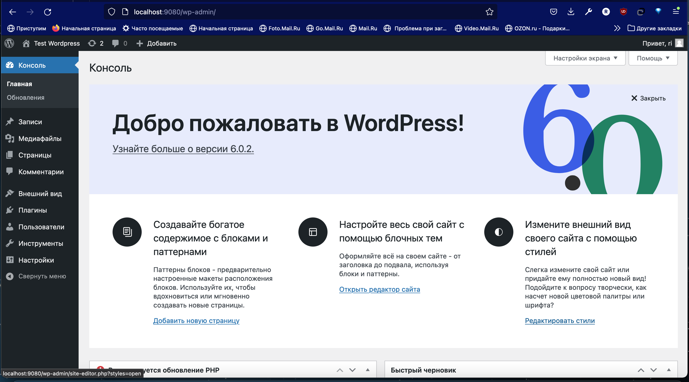
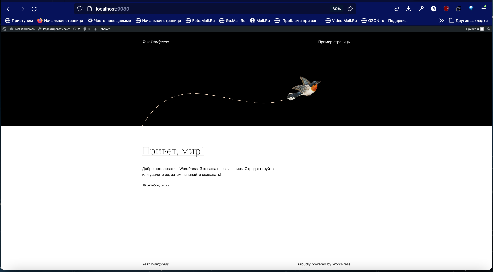
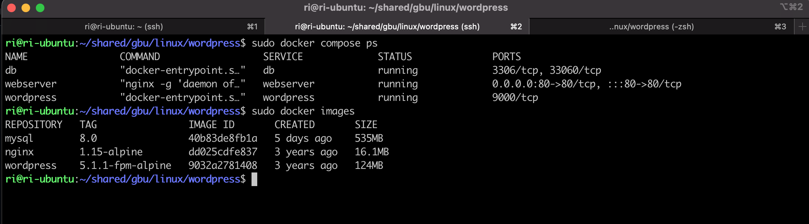

# Урок 7. Запуск веб-приложения из контейнеров

    
##   Задание 1. Установить в виртуальную машину или VDS Docker, настроить набор контейнеров через docker compose по инструкции по ссылке: https://www.digitalocean.com/community/tutorials/how-to-install-wordpress-with-docker-compose-ru. Часть с настройкой certbot и HTTPS опустить, если у вас нет настоящего домена и белого IP.

### Скриншоты работы Worpress

  

  

  